# Learning Online Platform (PERN)

Learning Online Platform is a full-stack web application for delivering structured online courses with authentication, enrollment, progress tracking, quizzes, reviews, and subscription payments.

## Project Purpose

This project is built to provide an end-to-end e-learning experience where:

- learners can discover courses, enroll, and track learning progress,
- instructors/admin workflows can manage course content (course -> module -> chapter -> lesson),
- users can complete quizzes and lessons to build completion history,
- subscription-based access can be handled through Stripe-powered payments.

The main goal is to combine a clean learning UI with a scalable backend/domain model for real online education workflows.

## Architecture Overview

- **Frontend:** React SPA (Vite) that handles UI, routing, user interaction, and API calls.
- **Backend:** Express API server with modular routes/controllers/repositories.
- **Database:** PostgreSQL with a relational schema for users, courses, lessons, enrollments, progress, subscriptions, and reviews.
- **Auth Session:** Cookie-based session auth using `express-session` + PostgreSQL session store.
- **Third-party services:** Stripe (payments), Cloudinary (media upload), Resend/Nodemailer (email flows).

## Tech Stack

### Frontend

- React 19
- React Router DOM
- TanStack React Query
- React Hook Form + Zod
- Tailwind CSS 4
- Vite
- React Toastify
- Swiper

### Backend

- Node.js + Express 5
- PostgreSQL (`pg`)
- `express-session` + `connect-pg-simple`
- `express-validator`
- `express-rate-limit`
- `bcrypt`
- `multer`
- Cloudinary SDK
- Stripe SDK
- Nodemailer + Resend

### Database / Infrastructure

- PostgreSQL (UUID-based primary keys via `pgcrypto`)
- SQL schema defined in `backend/src/configs/schema.sql`
- Environment-variable based configuration in `backend/src/configs/Env.js`

## Backend Explanation

The backend follows a layered modular pattern:

- **Routes layer** (`backend/src/routes`): Defines REST endpoints (users, courses, lessons, reviews, subscriptions, etc).
- **Controllers layer** (`backend/src/controllers`): Handles request/response logic and orchestration.
- **Repositories layer** (`backend/src/repositories`): Encapsulates SQL queries and data operations.
- **Middlewares** (`backend/src/middlewares`): Auth, authorization, validation, rate limiting, sessions, and error handling.
- **Configs** (`backend/src/configs`): Environment loading, DB pool, Cloudinary setup, SQL schema.

Core API domains exposed from `backend/src/app.js`:

- `/api/v1/users`
- `/api/v1/categories`
- `/api/v1/courses`
- `/api/v1/objectives`
- `/api/v1/modules`
- `/api/v1/chapters`
- `/api/v1/lessons`
- `/api/v1/contents`
- `/api/v1/reviews`
- `/api/v1/questions`
- `/api/v1/answers`
- `/api/v1/enrollments`
- `/api/v1/progresses`
- `/api/v1/completions`
- `/api/v1/subscriptions`
- `/api/v1/stripe-webhook`

### Backend Request Lifecycle

1. Request enters Express app (`backend/src/app.js`).
2. CORS, JSON parsing, rate limiting, and session middleware are applied.
3. Route-specific validators and auth middleware run.
4. Controller executes business logic.
5. Repository performs SQL operation via PostgreSQL pool.
6. Response returns JSON to frontend.
7. Global not-found and error middleware handle unmatched routes/errors.

## Frontend Explanation

The frontend is a React single-page app with route-driven screens and hook-based data access:

- **Routing:** `frontend/src/App.jsx` defines public and protected routes.
- **State/Data:** TanStack React Query handles server-state caching and fetching.
- **Auth context:** `frontend/src/contexts/AuthContext.jsx` stores current user session state.
- **API services:** `frontend/src/services/*Api.js` provide centralized `fetch` wrappers.
- **UI structure:** pages + reusable components for home, course listing, learning dashboard, lesson player, quiz, pricing, and settings.

Main user-facing flows include:

- auth flow (signup/login/logout/password reset),
- browsing courses and viewing details,
- enrollment and learning route navigation,
- lesson/quiz progression,
- review creation and summary display,
- subscription checkout success/cancel states.

## Database Design (Table List)

Defined in `backend/src/configs/schema.sql`.

### Identity & User

- `users`
- `user_profiles`
- `password_reset_codes`

### Catalog & Course Content

- `categories`
- `courses`
- `course_objectives`
- `modules`
- `chapters`
- `lessons`
- `lesson_content`
- `quizzes`
- `quiz_options`

### Enrollment & Learning Progress

- `enrollments`
- `learn_progress`
- `lesson_completion`
- `certificates`

### Subscriptions & Payments

- `subscription_plans`
- `user_subscriptions`
- `subscription_payments`

### Reviews & Moderation

- `course_reviews`
- `review_helpful_votes`
- `review_reports`

### Supporting Types / Utilities

- Enum types: `user_role`, `user_status`, `course_level`, `content_status`, `lesson_type`, `subscription_status`, `payment_status`, `access_course_type`, `gender`
- Trigger function: `set_updated_at()` used by update triggers on many tables

### ERD Diagram

  

### ER Diagram

  
  
## How Things Flow (End-to-End)

### 1) Authentication Flow

- User submits login/signup form in frontend.
- Frontend service calls backend auth endpoint with `credentials: include`.
- Backend validates input, hashes/checks password, creates session.
- Session cookie is stored in browser, session data persisted in PostgreSQL session store.
- Frontend fetches `/users/me` style profile data and updates auth context.

### 2) Course Discovery and Enrollment

- Frontend requests course list/details via course service.
- Backend returns course data with category/instructor metadata.
- User enrolls in course.
- Backend creates enrollment record (`enrollments`) and grants access based on free/subscription logic.

### 3) Learning and Progress Tracking

- Learner opens `/courses/:courseId/lessons/:lessonId`.
- Frontend fetches learning data, lesson content, and progress state.
- On lesson completion/progress update, frontend sends progress request.
- Backend updates `learn_progress` and inserts `lesson_completion`.
- Dashboard queries reflect in-progress/completed/recent courses.

### 4) Quiz and Assessment

- Quiz endpoints return question/options for lesson quizzes.
- User submits answer(s).
- Backend validates/correctness checks and updates completion/progress logic.

### 5) Subscription and Payment

- User chooses plan from pricing page.
- Frontend calls subscription endpoints to start payment flow.
- Backend creates Stripe payment intent and stores payment/subscription records.
- Stripe webhook endpoint confirms payment status.
- Backend activates/updates `user_subscriptions` and `subscription_payments`.
- Frontend shows payment success/cancel pages.

### 6) Reviews and Feedback

- Enrolled learner posts a review/rating for course.
- Backend stores review in `course_reviews`.
- Users can vote report/helpfulness, stored in moderation tables.
- Frontend refreshes review list/summary via React Query.

## Local Setup

### 1. Clone and install

```bash
git clone <your-repository-url>
cd LEARNING_ONLINE_PLATFORM
cd backend && npm install
cd ../frontend && npm install
```

### 2. Configure environment variables

Create environment files for backend and frontend.

### Backend variables (example names)

- `PORT`
- `NODE_ENV`
- `DATABASE_URL`
- `SESSION_SECRET`
- `COOKIE_NAME`
- `CLIENT_URL`
- `BREVO_API_KEY`
- `SENDER_EMAIL`
- `STRIPE_SECRET_KEY`
- `STRIPE_WEBHOOK_SECRET`
- `CLOUDINARY_NAME`
- `CLOUDINARY_API_KEY`
- `CLOUDINARY_SECRET_KEY`

### Frontend variables (example names)

- `VITE_BASE_URL` (example: `http://localhost:5000/api/v1`)

### 3. Run database schema

Execute `backend/src/configs/schema.sql` against your PostgreSQL database.

### 4. Start development servers

Backend:

```bash
cd backend
npm run dev
```

Frontend:

```bash
cd frontend
npm run dev
```

### Project Preview

   

- Link: [Visit App](https://learning-online-platform-pern.onrender.com/)

## Current Core Features

- Session-based authentication
- Role-ready user model (`LEARNER`, `INSTRUCTOR`, `ADMIN`)
- Course content hierarchy (course -> module -> chapter -> lesson)
- Lesson and quiz support
- Enrollment and learning progress tracking
- Course reviews with moderation helpers
- Subscription plans + Stripe payment integration
- Dashboard views for recent, in-progress, and completed courses
